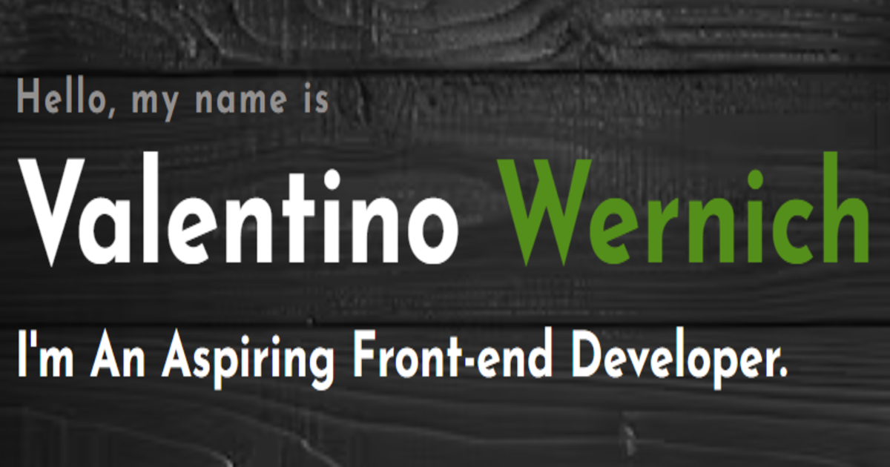

  

---

## 🌐 Portfolio.

🔗 [Visit My Portfolio](https://the-wernich.github.io/my-portfolio/)

---

## 📚 Currently Learning.

- 🟡 JavaScript – Intermediate: async/await, fetch API, modular code
- 🟡 React – Learning fundamentals: JSX, props, useState/useEffect
- 🟡 Git – Branching, merges, pull requests
- 🔵 Accessibility – Learning semantic HTML and screen-reader basics

---

## 🎯 Goals for 2025.

- Build 5 fully responsive web apps
- Master React fundamentals
- Master JavaScript fundamentals
- Learn basic back-end with Node.js or Firebase

---

## 💼 Portfolio Projects Codes.
- [01. Gaming Preference Survey.](https://github.com/The-Wernich/gaming-survey)
- [02. CSS Flexbox & Grid.](https://github.com/The-Wernich/css-flexbox-grid)
- [03. Steve Irwin Tribute.](https://github.com/The-Wernich/steve-irwin-tribute)
- [04. All-In-One-Calculator.](https://github.com/The-Wernich/all-in-one-calculator)

## 🌐 Portfolio Projects Sites.
- [01. Gaming Preference Survey.](https://the-wernich.github.io/gaming-survey/)
- [02. CSS Flexbox & Grid.](https://the-wernich.github.io/css-flexbox-grid/)
- [03. Steve Irwin Tribute.](https://the-wernich.github.io/steve-irwin-tribute/)
- [04. All-In-One-Calculator.](https://the-wernich.github.io/all-in-one-calculator/)

## 🧪 Side Projects.
- [todo-app](https://github.com/yourusername/side-todo-app)
- [markdown-blogger](https://github.com/yourusername/side-blog-generator)

---

## 💻 Languages & Tools.

  

---

## 🛠️ Tech Stack & Tools.

<table align="center">
  <tr>
    <td align="center" style="padding: 20px;">
      <a href="https://developer.mozilla.org/en-US/docs/Web/HTML" target="_blank" rel="noopener noreferrer">
         
      </a>
    </td>
    <td align="center" style="padding: 20px;">
      <a href="https://developer.mozilla.org/en-US/docs/Web/CSS" target="_blank">
         
      </a>
    </td>
    <td align="center" style="padding: 20px;">
      <a href="https://github.com" target="_blank">
         
      </a>
    </td>
    <td align="center" style="padding: 20px;">
      <a href="https://code.visualstudio.com/docs" target="_blank">
         
      </a>
    </td>
  </tr>
</table>

---

## 📫 Let's Connect.

<table align="center">
  <tr>
    <td>
      

    </td>
&nbsp;&nbsp;
    <td>

    </td>
  </tr>
</table>

---

> 🗓️ _I’m actively building and learning — check back often to see new projects and updates!_
